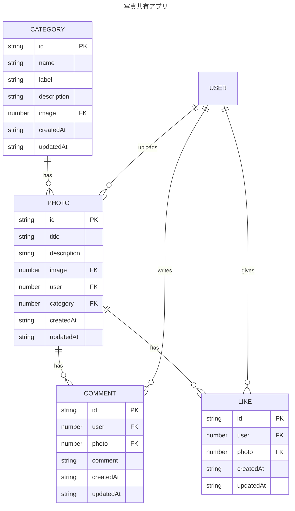

# sample-photo-app

## 技術スタック

### フロントエンド

- Next.js 14 App Router

### バックエンド

- Strapi 4

## ER 図

```mermaid
---
title: 写真共有アプリ
---
erDiagram
  CATEGORY {
    string id PK
    string name
    string label
    string description
    number image FK
    string createdAt
    string updatedAt
  }
  COMMENT {
    string id PK
    number user FK
    number photo FK
    string comment
    string createdAt
    string updatedAt
  }
  LIKE {
    string id PK
    number user FK
    number photo FK
    string createdAt
    string updatedAt
  }
  PHOTO {
    string id PK
    string title
    string description
    number image FK
    number user FK
    number category FK
    string createdAt
    string updatedAt
  }
  CATEGORY ||--o{ PHOTO : "has"
  PHOTO ||--o{ COMMENT : "has"
  PHOTO ||--o{ LIKE : "has"
  USER ||--o{ COMMENT : "writes"
  USER ||--o{ LIKE : "gives"
  USER ||--o{ PHOTO : "uploads"
```
