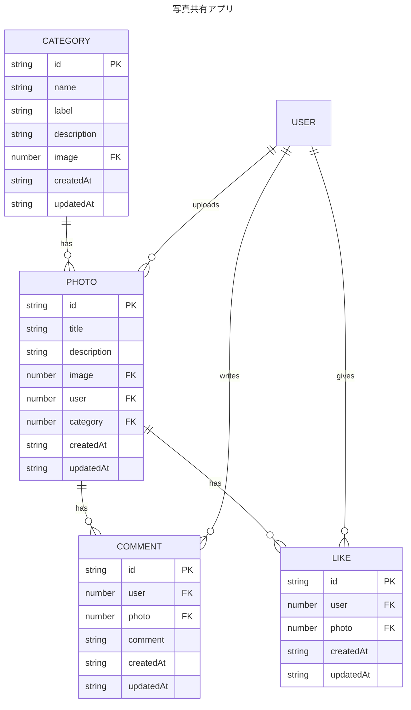

# sample-photo-app

## 初期設定

### バックエンド

1. .env ファイルを作成する

以下の内容は生成時のものです。デプロイ時には修正してください。

```.env
HOST=0.0.0.0
PORT=1337
APP_KEYS=VKklOzeJz6Hqh5QH6xCHxg==,DIeBbPOZ2jvkb8A5wygaHQ==,8QHIpgBtwnsepL1Rxuvs0A==,rIdtvgbKnAlcK7D0HyTBiw==
API_TOKEN_SALT=JVg6CqCPM5SPh4DVa5ceSQ==
ADMIN_JWT_SECRET=d4dANvv0H8bpO0J/iC2u8Q==
TRANSFER_TOKEN_SALT=tG0kDhzTn1TwrDozNu1cVw==
# Database
DATABASE_CLIENT=sqlite
DATABASE_FILENAME=.tmp/data.db
JWT_SECRET=g1vMsKV4pB28HuCaQ0SjNQ==
```

2. パッケージをインストールする

```bash
yarn install
```

3. 管理サイトを開く

```bash
yarn develop
```

```
http://localhost:1337
```

4. Settings の Providers からに GitHub の設定を行う

### フロントエンド

1. パッケージをインストールする

```bash
npm i
```

2. 開発用サーバを起動する

```bash
npm run dev
```

## 技術スタック

### フロントエンド

- Next.js 14 App Router

### バックエンド

- Strapi 4

## ER 図



## WebAPI

| 認証 | メソッド | エンドポイント            | 説明                     |
| :--: | -------: | :------------------------ | :----------------------- |
|      |      GET | /api/photos/[id]/likes    | 投稿写真のいいねの取得   |
|  ◯   |     POST | /api/photos/[id]/likes    | 投稿写真のいいねの作成   |
|  ◯   |      GET | /api/photos/[id]/likes/me | 投稿写真の自身のいいね   |
|  ◯   |   DELETE | /api/likes/[id]           | 投稿写真のいいねの削除   |
|      |      GET | /api/photos/[id]/comments | 投稿写真のコメントの取得 |
|  ◯   |     POST | /api/photos/[id]/comments | 投稿写真のコメントの作成 |
|  ◯   |   DELETE | /api/comments/[id]        | 投稿写真のコメントの削除 |
|  ◯   |     POST | /api/create/photo         | 写真の投稿               |

※1 写真の投稿 `/api/create/photo` を `/api/photos` に変更予定です。

※2 クライアントサイド(strapi client sdk)から strapi に直接アクセスしている処理を WebAPI 経由に変更予定です。
