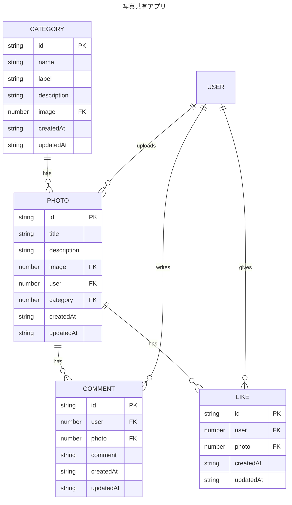

# sample-photo-app

## 技術スタック

### フロントエンド

- Next.js 14 App Router

### バックエンド

- Strapi 4

## ER 図

## WebAPI

| 認証 | メソッド | エンドポイント            | 説明                     |
| :--: | -------: | :------------------------ | :----------------------- |
|      |      GET | /api/photos/[id]/likes    | 投稿写真のいいねの取得   |
|  ◯   |     POST | /api/photos/[id]/likes    | 投稿写真のいいねの作成   |
|  ◯   |      GET | /api/photos/[id]/likes/me | 投稿写真の自身のいいね   |
|  ◯   |   DELETE | /api/likes/[id]           | 投稿写真のいいねの削除   |
|      |      GET | /api/photos/[id]/comments | 投稿写真のコメントの取得 |
|  ◯   |     POST | /api/photos/[id]/comments | 投稿写真のコメントの作成 |
|  ◯   |   DELETE | /api/comments/[id]        | 投稿写真のコメントの削除 |
|  ◯   |     POST | /api/create/photo         | 写真の投稿               |

※1 写真の投稿 `/api/create/photo` を `/api/photos` に変更予定です。

※2 クライアントサイド(strapi client sdk)から strapi に直接アクセスしている処理を WebAPI 経由に変更予定です。
